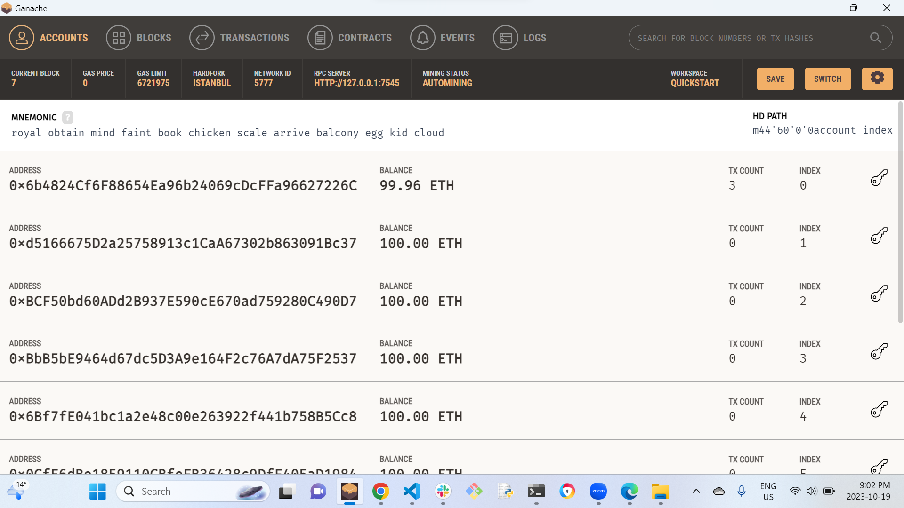
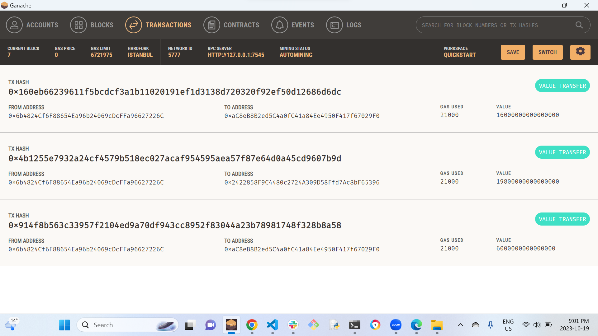

# Blockchain : Crypto currency Wallet
The aim of this project is to build a application where fintech professionals can be hired and paid using the Ethereum Blockchain Network. 

## About 
The applications for blockchain technology are endless. KryptoJobs2Go is a platform where customers looking to hire fintech professionals can do so in a decentralized application. Candidates can be hired and paid all in one place. Due to the trustless nature of blockchain, the transactions can be verified to ensure the integrity of both parties. 

## Getting Started 
To run the application, you need to have the following software and Python libraries installed: 

- Python 3.10 or later 

- Streamlit 

## Installing 
1. Install the latest verion of Python [here](https://www.python.org/downloads/). 

2. Install the lastest version of Ganache [here](https://trufflesuite.com/ganache/) 

3. To install the Streamlit packages, run the following command in your terminal. 

``` 
pip install Streamlit 
``` 
## Usage 
Open Ganache and create an Ethereum Workspace. 

Copy the mnemonic phrase generated by the Ethereum Workspace in Ganache and replace the current mnemonic phrase in the `.env` file. 

You can clone or download this GitHub project and open the `krypto_jobs.py` using any IDE of your choice, one being Visual Studio Code. In the terminal, navigate to the folder that the `krypto_jobs.py` file is located. Run the streamlit application by running the following command. 

``` 
streamlit run krypto_jobs.py 
``` 

In the sidebar, a Fintech Professional can be chosen using the "Select Person" dropdown box, and the "Number of Hours" to hire them can be entered in the text box below that. Total Wage will be shown in Ether, and pressing the "Send Transaction" button will process the transaction onto the blockchain and return the Validated Transaction Hash. 

# Report 
## Testing the Web Application 
### Sending the Transaction 

Hire Lane at an hourly rate of 0.2 ETH/hour.
<center>
    
</center>

### Verifying the Address Balances on Ganache

<center>
    
</center>

### Verifying the Blocks on Ganache
| |
|:--:|
|*Verify All Blocks on the Network*|
    
### Verifying the Transactions on Ganache

| |
|:--:|
|*Verify All Transactions on the Network*|

## Contributor
Harshita Panchal
